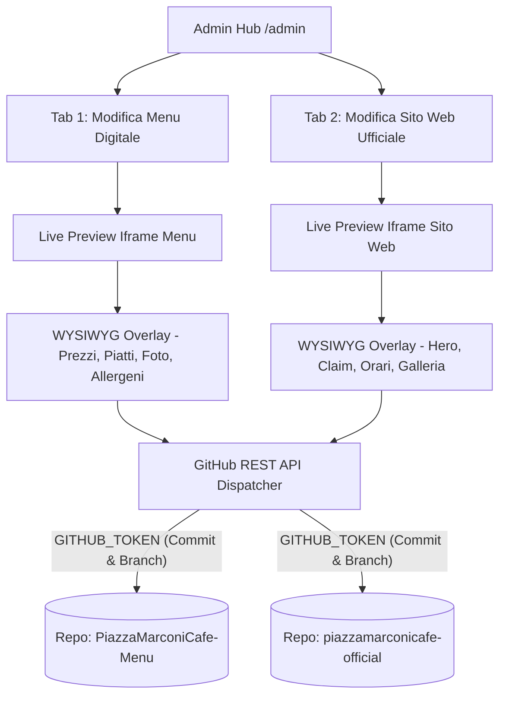

# Multi-Repository Visual Editor Architecture Design Spec

**Data**: 2026-09-10  
**Autore**: Principal DevOps & Full-Stack Architect  
**Stato**: Proposta Approvata / In Esecuzione

---

## 1. Obiettivo Architetturale

Reingegnerizzare l'interfaccia amministrativa `/admin` per operare come **Multi-Repository Hub & Visual WYSIWYG Editor**, consentendo al personale del locale di modificare in tempo reale i contenuti di due repository distinti tramite il `GITHUB_TOKEN` configurato in ambiente:

1. **Repository Menu Digitale**: `mannellimau-lang/PiazzaMarconiCafe-Menu`
2. **Repository Sito Web Ufficiale**: `mannellimau-lang/piazzamarconicafe-official`

---

## 2. Componenti del Sistema

### 2.1 Admin Hub & Tab Switcher (`/admin/index.html`)
- UI lussuosa e scura coordinata con l'identità visiva del Piazza Marconi Cafe.
- Header con Selettore Repository:
  - `[ 🍕 Modifica Menu Digitale ]`
  - `[ 🌐 Modifica Sito Web Ufficiale ]`
- Stato di autenticazione e sicurezza tramite `GITHUB_TOKEN` / PIN locale.

### 2.2 Live Visual Editing Engine (WYSIWYG a Specchio)
- **Modalità Specchio 1:1**: Carica in un container responsive l'anteprima esatta del sito selezionato.
- **Inline Text & Price Editing**: Campi di testo con `contenteditable` o form laterali coordinati per modificare prezzi (`p1`, `p2`), nomi prodotti, allergeni e claim.
- **Photo Upload & Lightbox**: Pulsante di upload da fotocamera/rullino con anteprima immediata prima del salvataggio.

### 2.3 Dual GitHub Commit Dispatcher
- Funzione JS client-side che interagisce direttamente con l'API GitHub (`https://api.github.com/repos/{owner}/{repo}/contents/{path}`).
- **Isolamento dei Branch**:
  - Salva le modifiche sul branch temporaneo `feature/multi-repo-admin` del rispettivo repository.
  - Genera commit trasparenti con messaggio strutturato.

---

## 3. Matrice Dati per Repository

| Repository | Path File Dati | Contenuto Gestito |
|---|---|---|
| `mannellimau-lang/PiazzaMarconiCafe-Menu` | `content/menu.json` / `index.html` | Prodotti, Prezzi, Allergeni, Granite, Panini, Bar |
| `mannellimau-lang/piazzamarconicafe-official` | `src/content/hero.json`, `alerts.json`, `gallery.json` | Claim Hero, Avvisi in evidenza, Orari, Galleria |

---

## 4. Protocollo di Sicurezza & Collaudo

1. Nessuna credenziale hardcodata nei file pubblici (uso sicuro di `GITHUB_TOKEN` da ambiente o via proxy/headers).
2. Commit isolati su branch `feature/multi-repo-admin`.
3. Stop bloccante fino al messaggio esatto **APPROVATO**.
